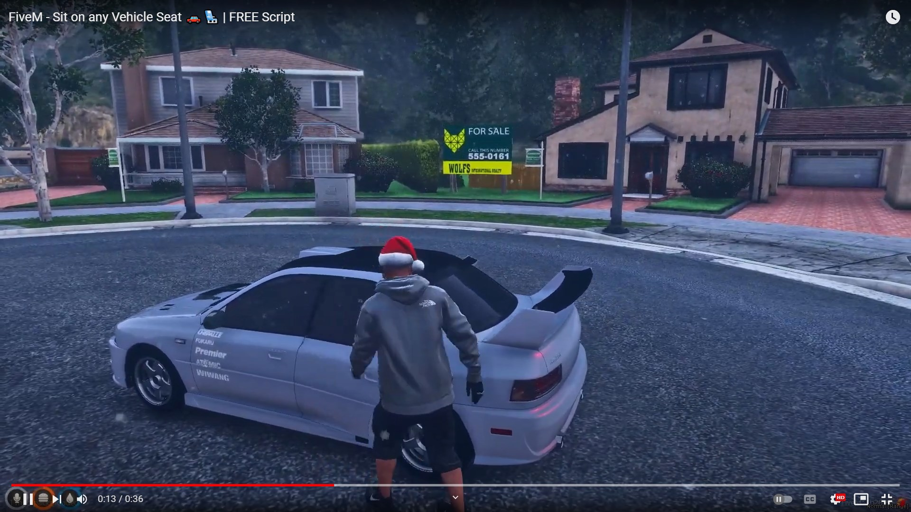

# **Sit on any vehicle seat** 🚗💺 | FREE-FiveM-Script
### Do you have to wait until driver get-in to the vehicle? 🚗😕

### Because otherwise your player get-in to the driving seat? No Worries! 🕺🏼 I got you.

<br>

[ ](https://youtu.be/YSvAPxOT5No "FiveM - Sit on any Vehicle Seat 🚗💺 | FREE Script") 
<br>

## Features 💼
- 💺 Players can **sit on any vehicle seat** they want, **without waiting for the driver**.
- 🎪 Well optimized.
- 🕊 Doesn't feel it running, even for a potato pc.

---
## Requirements 🧰
- **Nothing.** Oh! But, Ofc You need a FiveM server. 😜
- This is a **standalone** script. It means this works on any framework. (QB, ESX, Whatever)

---
## Installation 🐌

```
- free download the script from my tebex.store (link down below ↓)
- unzip the file → mrm-SitAnySeat
- place it somewhere in your server's resource folder
```

```
- add → ensure mrm-SitAnySeat ...to your server.cfg
- restart the server
```

### **📍 Keep in mind:**
> The script will not work, if you change the resource folder name to something else, other than **mrm-SitAnySeat**. 

---
## 🌎 [Download](https://mrm.tebex.io/package/5521198) :
> You can free download the script from my **[Tebex Store](https://mrm.tebex.io/package/5521198)**.

---
> Inspired by @Rufi 🤍
